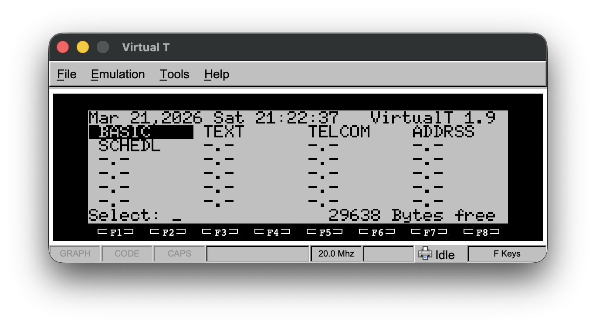
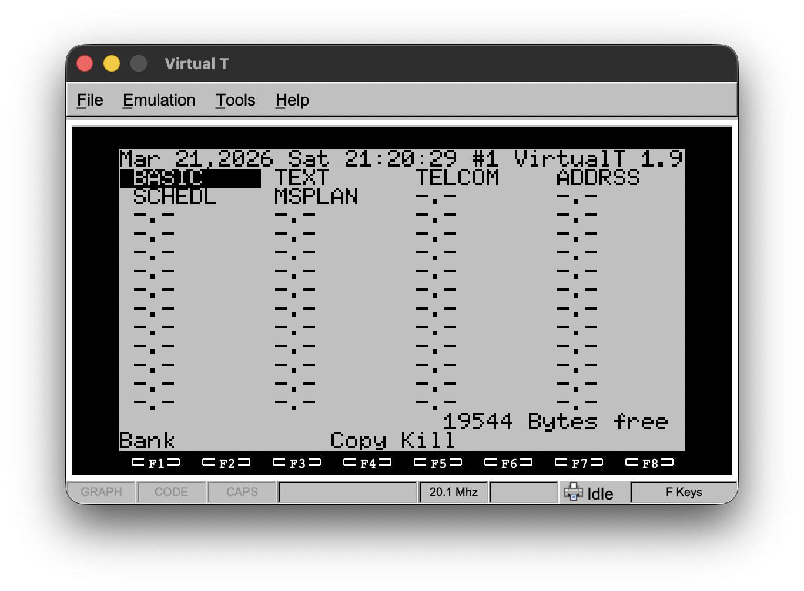

# VirtualT

A cross-platform TRS-80 Model 100/102/200 emulator that runs on Windows, Linux, and Macintosh.


Built with **C++ 17** and **FLTK 1.4+**.

---

## Features

- Cross-platform: **macOS**, **Windows 11**, **Linux**

---

## Current Release

- Version 2.1
 
---

## Background

I ran into several build warnings and errors when I tried to build Version 1.7 of [McNeight/VirtualT](https://github.com/McNeight/VirtualT/tree/master) on macOS 26.3, so I cloned his respository and went to work fixing these issues. Version 1.8 was the first of my versions to build with no errors, but I started running into some other issues as I began regression testing. See [ChangeLog](./ChangeLog) for a summary of my fixes.

---

## Screenshots

Model 100

Tandy 200


---

## Help Documentation

See [VirtualT Help](doc/help.html).

---

## Project Structure (not yet fully populated)

```text
VirtualT/
├── ChangeLog               # Version history
├── LICENSE                 # Software license description
├── README.md               # This file
└── src/
```

---

## Dependencies

| Dependency   | Version | Notes                         |
|--------------|---------|-------------------------------|
| Make         | ≥ 3.8   | Build system                  |
| FLTK         | ≥ 1.4   | GUI framework                 |
| C++ compiler | C++17   | GCC 9+, Clang 10+, MSVC 2019+ |

---

## Building (not yet populated)

### macOS

---

### Linux

---

### Microsoft Windows 11

---

## License

Released under the BSD License. See LICENSE file for details.
